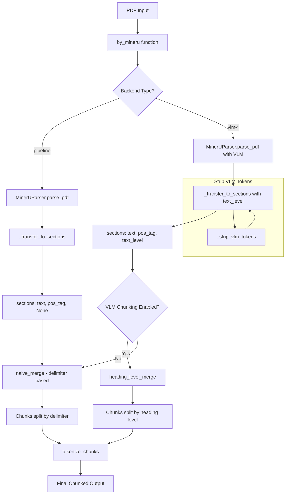

# MinerU VLM Heading-Level Based Chunking Implementation Plan

## Overview

This document outlines the implementation plan for adding heading-level based chunking support for MinerU VLM (Vision Language Model) backend output in RAGFlow. The current delimiter-based chunking doesn't work well with VLM output, and this feature will leverage the `text_level` field from MinerU's VLM output for intelligent, semantic chunking.

## Implementation Status: COMPLETED

**Date Completed:** 2025-12-03
**Last Verified:** 2025-12-05

### Files Modified

1. **[`deepdoc/parser/mineru_parser.py`](../../deepdoc/parser/mineru_parser.py)**
   - Added VLM content types to [`MinerUContentType`](../../deepdoc/parser/mineru_parser.py:46) enum (lines 46-58)
   - Added [`_strip_vlm_tokens()`](../../deepdoc/parser/mineru_parser.py:457) static method (lines 457-462)
   - Modified [`_transfer_to_sections()`](../../deepdoc/parser/mineru_parser.py:491) to return 3-tuples (lines 491-529)
   - TEXT content types now include `text_level` from VLM output

2. **[`rag/nlp/__init__.py`](../../rag/nlp/__init__.py)**
   - Added [`heading_level_merge()`](../../rag/nlp/__init__.py:846) function (lines 846-903)
   - Supports both 2-tuple and 3-tuple section formats for backward compatibility

3. **[`rag/app/naive.py`](../../rag/app/naive.py)**
   - Added `heading_level_merge` to imports (line 40)
   - Added [`is_mineru_vlm_backend()`](../../rag/app/naive.py:43) helper function (lines 43-46)
   - Modified [`by_mineru()`](../../rag/app/naive.py:66) to return 4-tuple including backend (lines 66-88)
   - Added parser result unpacking logic (lines 727-731)
   - Added VLM chunking pathway in [`chunk()`](../../rag/app/naive.py:736) function (lines 736-758)

### Additional Documentation

- **[Module Interconnections Guide](./mineru-vlm-module-interconnections.md)** - Comprehensive reference for all module dependencies, imports, and data flows

### Configuration

New parser config option:
- `vlm_chunk_heading_level`: Integer (default: 2) - Controls heading level for chunk splitting
  - 1 = Split only at h1 headings
  - 2 = Split at h1 and h2 headings
  - 3 = Split at h1, h2, and h3 headings

## Background

### Previous Fix (Already Implemented)

An `AttributeError: HEADER` was occurring during chunking because MinerU's VLM backend returns content types (`header`, `footer`, `page_number`, `title`) that weren't defined in the `MinerUContentType` enum. This was fixed by:

1. Adding `HEADER`, `FOOTER`, `PAGE_NUMBER`, `TITLE` to the [`MinerUContentType`](../../deepdoc/parser/mineru_parser.py:46) enum (lines 54-58)
2. Updating [`_transfer_to_sections()`](../../deepdoc/parser/mineru_parser.py:521) to handle these types and skip them (line 521)

### Current Issue

The MinerU VLM backend provides rich semantic information in its output, including:
- `text_level`: Integer field representing heading level (1=h1, 2=h2, etc.)
- `<|im_end|>`: Special token appended by the VLM that needs stripping

The current delimiter-based chunking in [`naive_merge()`](../../rag/nlp/__init__.py:787) parses delimiter strings character-by-character, which doesn't work well for semantic document structure.

### Example MinerU VLM Output

From [`eao_page_content_list.json`](../../output_example/eao_page/auto/eao_page_content_list.json):

```json
{
    "type": "text",
    "text": "EA REVITALIZATION REGULATION & POLICY DEVELOPMENT<|im_end|>",
    "text_level": 1,
    "bbox": [42, 122, 464, 145],
    "page_idx": 0
}
```

## Implementation Plan

### Environment Variables

The following environment variables control MinerU behavior:
- `MINERU_BACKEND`: Backend type (`pipeline`, `vlm-http-client`, `vlm-transformers`, `vlm-vllm-engine`)
- `MINERU_SERVER_URL`: VLM server URL for `vlm-http-client` backend
- `MINERU_APISERVER`: MinerU API server URL
- `MINERU_OUTPUT_DIR`: Output directory for parsed files
- `MINERU_DELETE_OUTPUT`: Whether to delete output after processing (0 or 1)

---

## Subtask 1: Strip `<|im_end|>` Tokens in mineru_parser.py ✅

**File:** [`deepdoc/parser/mineru_parser.py`](../../deepdoc/parser/mineru_parser.py)

**Location:** [`_transfer_to_sections()`](../../deepdoc/parser/mineru_parser.py:491) method (lines 491-529)

**Status:** IMPLEMENTED - `_strip_vlm_tokens()` at lines 457-462

**Description:** Strip the `<|im_end|>` token from all text content before returning sections.

### Current Code (lines 484-511):

```python
def _transfer_to_sections(self, outputs: list[dict[str, Any]]):
    sections = []
    for output in outputs:
        section = None
        match output["type"]:
            case MinerUContentType.TEXT:
                section = output["text"]
            case MinerUContentType.TABLE:
                section = output.get("table_body", "") + "\n".join(output.get("table_caption", [])) + "\n".join(output.get("table_footnote", []))
                if not section.strip():
                    section = "FAILED TO PARSE TABLE"
            case MinerUContentType.IMAGE:
                section = "".join(output.get("image_caption", [])) + "\n" + "".join(output.get("image_footnote", []))
            case MinerUContentType.EQUATION:
                section = output["text"]
            case MinerUContentType.CODE:
                section = output["code_body"] + "\n".join(output.get("code_caption", []))
            case MinerUContentType.LIST:
                section = "\n".join(output.get("list_items", []))
            case MinerUContentType.DISCARDED | MinerUContentType.HEADER | MinerUContentType.FOOTER | MinerUContentType.PAGE_NUMBER | MinerUContentType.TITLE:
                pass
            case _:
                self.logger.warning(f"[MinerU] Unknown content type '{output['type']}' encountered, skipping.")

        if section:
            sections.append((section, self._line_tag(output)))
    return sections
```

### Proposed Change:

Add a helper method to strip VLM tokens and apply it to all text content:

```python
@staticmethod
def _strip_vlm_tokens(text: str) -> str:
    """Strip VLM-specific tokens like <|im_end|> from text."""
    if text:
        return text.replace("<|im_end|>", "").strip()
    return text

def _transfer_to_sections(self, outputs: list[dict[str, Any]]):
    sections = []
    for output in outputs:
        section = None
        match output["type"]:
            case MinerUContentType.TEXT:
                section = self._strip_vlm_tokens(output["text"])
            case MinerUContentType.TABLE:
                table_body = self._strip_vlm_tokens(output.get("table_body", ""))
                table_caption = [self._strip_vlm_tokens(c) for c in output.get("table_caption", [])]
                table_footnote = [self._strip_vlm_tokens(f) for f in output.get("table_footnote", [])]
                section = table_body + "\n".join(table_caption) + "\n".join(table_footnote)
                if not section.strip():
                    section = "FAILED TO PARSE TABLE"
            case MinerUContentType.IMAGE:
                image_caption = [self._strip_vlm_tokens(c) for c in output.get("image_caption", [])]
                image_footnote = [self._strip_vlm_tokens(f) for f in output.get("image_footnote", [])]
                section = "".join(image_caption) + "\n" + "".join(image_footnote)
            case MinerUContentType.EQUATION:
                section = self._strip_vlm_tokens(output["text"])
            case MinerUContentType.CODE:
                code_body = self._strip_vlm_tokens(output.get("code_body", ""))
                code_caption = [self._strip_vlm_tokens(c) for c in output.get("code_caption", [])]
                section = code_body + "\n".join(code_caption)
            case MinerUContentType.LIST:
                list_items = [self._strip_vlm_tokens(item) for item in output.get("list_items", [])]
                section = "\n".join(list_items)
            case MinerUContentType.DISCARDED | MinerUContentType.HEADER | MinerUContentType.FOOTER | MinerUContentType.PAGE_NUMBER | MinerUContentType.TITLE:
                pass
            case _:
                self.logger.warning(f"[MinerU] Unknown content type '{output['type']}' encountered, skipping.")

        if section:
            sections.append((section, self._line_tag(output)))
    return sections
```

---

## Subtask 2: Pass `text_level` from mineru_parser.py ✅

**File:** [`deepdoc/parser/mineru_parser.py`](../../deepdoc/parser/mineru_parser.py)

**Location:** [`_transfer_to_sections()`](../../deepdoc/parser/mineru_parser.py:491) method (lines 491-529)

**Status:** IMPLEMENTED - Returns 3-tuple at line 528

**Description:** Modify the return format to include `text_level` for TEXT content types while maintaining backward compatibility.

### Proposed Change:

Return a 3-tuple `(text, position_tag, text_level)` instead of 2-tuple, where `text_level` is `None` for non-TEXT types:

```python
def _transfer_to_sections(self, outputs: list[dict[str, Any]]):
    sections = []
    for output in outputs:
        section = None
        text_level = None  # Only set for TEXT type
        
        match output["type"]:
            case MinerUContentType.TEXT:
                section = self._strip_vlm_tokens(output["text"])
                text_level = output.get("text_level")  # Get text_level from VLM output
            case MinerUContentType.TABLE:
                # ... existing code ...
            # ... other cases remain the same ...

        if section:
            sections.append((section, self._line_tag(output), text_level))
    return sections
```

### Backward Compatibility

The existing callers iterate over sections as `(text, position)` tuples. We need to ensure:
1. For VLM backends: Return 3-tuples with `text_level`
2. For pipeline backend: Return 3-tuples with `text_level=None`

This way, callers can check the length or use unpacking with defaults.

---

## Subtask 3: Create VLM Chunking Pathway in naive.py ✅

**File:** [`rag/app/naive.py`](../../rag/app/naive.py)

**Location:**
- Helper function at lines 43-46
- `by_mineru()` at lines 66-88
- VLM chunking pathway at lines 736-758

**Status:** IMPLEMENTED

**Description:** Create a conditional pathway that detects VLM backend and routes to heading-level based chunking.

### Helper Function to Detect VLM Backend:

```python
def is_mineru_vlm_backend() -> bool:
    """Check if MinerU is configured to use a VLM backend."""
    backend = os.environ.get("MINERU_BACKEND", "pipeline")
    return backend in ("vlm-http-client", "vlm-transformers", "vlm-vllm-engine")
```

### Modify by_mineru() to Pass Backend Info:

```python
def by_mineru(filename, binary=None, from_page=0, to_page=100000, lang="Chinese", callback=None, pdf_cls=None, **kwargs):
    mineru_executable = os.environ.get("MINERU_EXECUTABLE", "mineru")
    mineru_api = os.environ.get("MINERU_APISERVER", "http://host.docker.internal:9987")
    backend = os.environ.get("MINERU_BACKEND", "pipeline")
    
    pdf_parser = MinerUParser(mineru_path=mineru_executable, mineru_api=mineru_api)
    parse_method = kwargs.get("parse_method", "raw")

    if not pdf_parser.check_installation(backend=backend, server_url=os.environ.get("MINERU_SERVER_URL", "")):
        callback(-1, "MinerU not found.")
        return None, None, pdf_parser, backend  # Return backend info

    sections, tables = pdf_parser.parse_pdf(
        filepath=filename,
        binary=binary,
        callback=callback,
        output_dir=os.environ.get("MINERU_OUTPUT_DIR", ""),
        backend=backend,
        server_url=os.environ.get("MINERU_SERVER_URL", ""),
        delete_output=bool(int(os.environ.get("MINERU_DELETE_OUTPUT", 1))),
        parse_method=parse_method
    )
    return sections, tables, pdf_parser, backend  # Return backend info
```

### Conditional Chunking in chunk() Function:

Around line 720 in [`chunk()`](rag/app/naive.py:604), after parsing:

```python
if name == "mineru":
    sections, tables, pdf_parser, backend = parser(...)
    
    # Check if VLM backend and heading-level chunking is requested
    if backend.startswith("vlm-"):
        # Use heading-level based chunking
        heading_level = int(parser_config.get("vlm_chunk_heading_level", 2))
        chunks = heading_level_merge(
            sections, 
            heading_level=heading_level,
            chunk_token_num=int(parser_config.get("chunk_token_num", 128))
        )
        res.extend(tokenize_chunks(chunks, doc, is_english, pdf_parser))
    else:
        # Existing pipeline backend handling
        parser_config["chunk_token_num"] = 0
        # ... existing code ...
```

---

## Subtask 4: Create Heading-Level Merge Function in rag/nlp/__init__.py ✅

**File:** [`rag/nlp/__init__.py`](../../rag/nlp/__init__.py)

**Location:** After [`naive_merge()`](../../rag/nlp/__init__.py:787) function, at lines 846-903

**Status:** IMPLEMENTED

**Description:** Create a new function that merges sections based on heading levels from MinerU VLM output.

### Proposed Implementation:

```python
def heading_level_merge(
    sections: list[tuple],
    heading_level: int = 2,
    chunk_token_num: int = 128
) -> list[str]:
    """
    Merge sections based on heading levels from MinerU VLM output.
    
    Args:
        sections: List of (text, position_tag, text_level) tuples from MinerU VLM
        heading_level: Split at this heading level and above (1=h1, 2=h1+h2, etc.)
        chunk_token_num: Maximum tokens per chunk (0 to disable token-based splitting)
    
    Returns:
        List of merged text chunks
    
    Example:
        If heading_level=2, chunks split at every h1 and h2 heading.
        If heading_level=1, chunks only split at h1 headings.
    """
    if not sections:
        return []
    
    chunks = []
    current_chunk = []
    current_tokens = 0
    
    for section in sections:
        # Handle both 2-tuple and 3-tuple formats
        if len(section) >= 3:
            text, pos_tag, text_level = section[0], section[1], section[2]
        else:
            text, pos_tag = section[0], section[1]
            text_level = None
        
        text_tokens = num_tokens_from_string(text)
        
        # Check if this section is a heading that should trigger a split
        should_split = False
        if text_level is not None and text_level <= heading_level:
            should_split = True
        
        # If we should split and have content, finalize current chunk
        if should_split and current_chunk:
            chunks.append("\n".join(current_chunk))
            current_chunk = []
            current_tokens = 0
        
        # Add text to current chunk
        # Include position tag if present and text is substantial
        if pos_tag and text_tokens >= 8:
            current_chunk.append(text + pos_tag)
        else:
            current_chunk.append(text)
        current_tokens += text_tokens
        
        # If token limit exceeded (and not disabled), split here
        if chunk_token_num > 0 and current_tokens > chunk_token_num:
            chunks.append("\n".join(current_chunk))
            current_chunk = []
            current_tokens = 0
    
    # Don't forget the last chunk
    if current_chunk:
        chunks.append("\n".join(current_chunk))
    
    return chunks
```

### Export the Function:

Add to the module's exports so it can be imported in [`naive.py`](../../rag/app/naive.py):

```python
# At line 40 of naive.py:
from rag.nlp import concat_img, find_codec, naive_merge, naive_merge_with_images, naive_merge_docx, rag_tokenizer, tokenize_chunks, tokenize_chunks_with_images, tokenize_table, attach_media_context, heading_level_merge
```

**Status:** IMPLEMENTED at line 40

---

## Subtask 5: Add Parser Config Option for Heading Level ✅

**File:** [`rag/app/naive.py`](../../rag/app/naive.py)

**Status:** IMPLEMENTED - Used at lines 739-740

**Description:** Document and handle the new `vlm_chunk_heading_level` parser config option.

### Usage:

```python
parser_config = {
    "chunk_token_num": 512,
    "delimiter": "\n!?。；！？",
    "layout_recognize": "MinerU",
    "vlm_chunk_heading_level": 2  # Split at h1 and h2 headings
}
```

### Behavior:

| `vlm_chunk_heading_level` | Behavior |
|---------------------------|----------|
| 1 | Split only at h1 headings |
| 2 | Split at h1 and h2 headings |
| 3 | Split at h1, h2, and h3 headings |
| etc. | Continue pattern |

---

## Architecture Diagram



---

## Testing Plan

### Test Cases:

1. **VLM Backend Detection**
   - Set `MINERU_BACKEND=vlm-http-client` and verify heading-level chunking is used
   - Set `MINERU_BACKEND=pipeline` and verify delimiter-based chunking is used

2. **Token Stripping**
   - Input text containing `<|im_end|>` tokens
   - Verify output has no `<|im_end|>` tokens

3. **Heading Level Splitting**
   - Document with h1, h2, h3 headings
   - `heading_level=1`: Only split at h1
   - `heading_level=2`: Split at h1 and h2
   - `heading_level=3`: Split at h1, h2, and h3

4. **Backward Compatibility**
   - Run with pipeline backend
   - Verify existing behavior unchanged

5. **Token Limit Enforcement**
   - Large document sections
   - Verify chunks don't exceed `chunk_token_num` when set

### Test Document:

Use the existing [`eao_page_content_list.json`](output_example/eao_page/auto/eao_page_content_list.json) which contains:
- TEXT with `text_level: 1`
- TABLE content
- HEADER, PAGE_NUMBER types (should be skipped)

---

## File Changes Summary

| File | Changes | Key Lines |
|------|---------|-----------|
| [`deepdoc/parser/mineru_parser.py`](../../deepdoc/parser/mineru_parser.py) | Add VLM content types, `_strip_vlm_tokens()`, modify `_transfer_to_sections()` | 46-58, 457-462, 491-529 |
| [`rag/app/naive.py`](../../rag/app/naive.py) | Add `is_mineru_vlm_backend()`, modify `by_mineru()`, add VLM chunking pathway | 40, 43-46, 66-88, 727-731, 736-758 |
| [`rag/nlp/__init__.py`](../../rag/nlp/__init__.py) | Add `heading_level_merge()` function | 846-903 |

---

## Rollback Plan

If issues arise:
1. Set `MINERU_BACKEND=pipeline` to use existing behavior
2. Or set `vlm_chunk_heading_level=0` to disable heading-level chunking (fallback to delimiter)

---

## Notes

- This implementation is designed to be non-breaking for upstream PR submission
- All changes are additive and conditional based on environment variables
- The 3-tuple return format maintains backward compatibility by checking tuple length

---

## Known Issues

### Health Check Endpoint

**Issue:** The `check_installation()` method in `mineru_parser.py` uses `/openapi.json` as the health check endpoint (line 135), but some VLM servers use `/health` instead.

**Symptom:**
```
[MinerU] vlm-http-client server not accessible: http://192.168.68.186:8080
```

**Recommended Fix:** Modify lines 133-154 to try `/health` first, then fall back to `/openapi.json`. See [Module Interconnections Guide](./mineru-vlm-module-interconnections.md#health-check-endpoint-issue) for detailed fix.

---

## Verification Commands

### Check if all imports work
```bash
docker exec -it <container> python -c "from rag.nlp import heading_level_merge; print('OK')"
```

### Check function location
```bash
docker exec -it <container> grep -n "def heading_level_merge" /ragflow/rag/nlp/__init__.py
# Expected output: 846:def heading_level_merge(
```

### Clear Python cache (if imports fail unexpectedly)
```bash
docker exec -it <container> find /ragflow -name "*.pyc" -delete
docker exec -it <container> find /ragflow -name "__pycache__" -type d -exec rm -rf {} +
```
