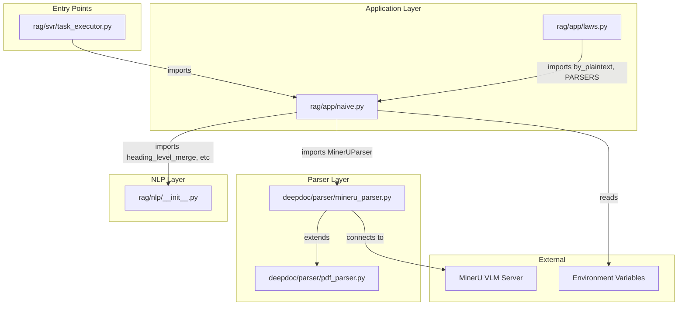

# MinerU VLM Module Interconnections & Implementation Verification

## Overview

This document maps all interconnections between modules, functions, variables, kwargs, and imports involved in the MinerU VLM heading-level chunking feature. Use this as a reference to ensure all changes are properly integrated.

---

## Module Dependency Graph



---

## File-by-File Analysis

### 1. `rag/nlp/__init__.py`

**Location of `heading_level_merge`:** Lines 846-903

**Function Signature:**
```python
def heading_level_merge(
    sections: list[tuple],
    heading_level: int = 2,
    chunk_token_num: int = 128,
) -> list[str]:
```

**Dependencies Used:**
- [`num_tokens_from_string`](../../common/token_utils.py) - imported at line 21

**Exports Required:**
- Function must be accessible via `from rag.nlp import heading_level_merge`

**Verification Checklist:**
- [x] Function defined (lines 846-903)
- [x] Uses `num_tokens_from_string` correctly
- [x] Handles both 2-tuple and 3-tuple section formats
- [x] Returns `list[str]`

---

### 2. `rag/app/naive.py`

**Imports from `rag/nlp` (Line 40):**
```python
from rag.nlp import concat_img, find_codec, naive_merge, naive_merge_with_images, naive_merge_docx, rag_tokenizer, tokenize_chunks, tokenize_chunks_with_images, tokenize_table, attach_media_context, heading_level_merge
```

**All imports that must exist in `rag/nlp/__init__.py`:**

| Import | Status | Line in rag/nlp/__init__.py |
|--------|--------|------------------------------|
| `concat_img` | ✅ | 989-1015 |
| `find_codec` | ✅ | 54-72 |
| `naive_merge` | ✅ | 787-843 |
| `naive_merge_with_images` | ✅ | 906-973 |
| `naive_merge_docx` | ✅ | 1018-1064 |
| `rag_tokenizer` | ✅ | Exported via `__all__` (line 31) |
| `tokenize_chunks` | ✅ | 276-304 |
| `tokenize_chunks_with_images` | ✅ | 307-326 |
| `tokenize_table` | ✅ | 329-358 |
| `attach_media_context` | ✅ | 361-547 |
| `heading_level_merge` | ✅ | 846-903 |

**Helper Function `is_mineru_vlm_backend()` (Lines 43-46):**
```python
def is_mineru_vlm_backend() -> bool:
    """Check if MinerU is configured to use a VLM backend."""
    backend = os.environ.get("MINERU_BACKEND", "pipeline")
    return backend.startswith("vlm-")
```

**`by_mineru()` Function (Lines 66-88):**
- Returns 4-tuple: `(sections, tables, pdf_parser, backend)`
- Other parsers return 3-tuple: `(sections, tables, pdf_parser)`

**VLM Chunking Pathway (Lines 736-758):**
```python
# Handle VLM backend with heading-level chunking for mineru
if name == "mineru" and backend and backend.startswith("vlm-"):
    # Use heading-level based chunking for VLM output
    heading_level = int(parser_config.get("vlm_chunk_heading_level", 2))
    chunk_token = int(parser_config.get("chunk_token_num", 0))
    
    chunks = heading_level_merge(
        sections,
        heading_level=heading_level,
        chunk_token_num=chunk_token
    )
    ...
```

**Parser Return Handling (Lines 727-731):**
```python
# Unpack based on parser type
if name == "mineru" and len(parser_result) == 4:
    sections, tables, pdf_parser, backend = parser_result
else:
    sections, tables, pdf_parser = parser_result
    backend = None
```

---

### 3. `deepdoc/parser/mineru_parser.py`

**`MinerUContentType` Enum (Lines 46-58):**
```python
class MinerUContentType(StrEnum):
    IMAGE = "image"
    TABLE = "table"
    TEXT = "text"
    EQUATION = "equation"
    CODE = "code"
    LIST = "list"
    DISCARDED = "discarded"
    # VLM backend additional types (typically discarded for RAG)
    HEADER = "header"
    FOOTER = "footer"
    PAGE_NUMBER = "page_number"
    TITLE = "title"
```

**`_strip_vlm_tokens()` Static Method (Lines 457-462):**
```python
@staticmethod
def _strip_vlm_tokens(text: str) -> str:
    """Strip VLM-specific tokens like <|im_end|> from text."""
    if text:
        return text.replace("<|im_end|>", "").strip()
    return text
```

**`_transfer_to_sections()` Method (Lines 491-529):**
- Returns 3-tuple: `(section_text, position_tag, text_level)`
- `text_level` is `None` for non-TEXT types and pipeline backend
- `text_level` is an integer (1-6) for VLM TEXT types

**`check_installation()` Health Check (Lines 133-154):**
```python
if backend == "vlm-http-client" and server_url:
    try:
        server_accessible = self._is_http_endpoint_valid(server_url + "/openapi.json")
        ...
```

**Issue Identified:** Uses `/openapi.json` instead of `/health`

---

## Environment Variables

| Variable | Default | Used In | Purpose |
|----------|---------|---------|---------|
| `MINERU_BACKEND` | `"pipeline"` | naive.py:69, naive.py:45 | Selects backend type |
| `MINERU_SERVER_URL` | `""` | naive.py:74, naive.py:84 | VLM server URL for vlm-http-client |
| `MINERU_APISERVER` | `"http://host.docker.internal:9987"` | naive.py:68 | MinerU API server |
| `MINERU_OUTPUT_DIR` | `""` | naive.py:82 | Output directory |
| `MINERU_DELETE_OUTPUT` | `"1"` | naive.py:85 | Delete temp files |
| `MINERU_EXECUTABLE` | `"mineru"` | naive.py:67 | Path to mineru CLI |

---

## Parser Config Options

| Option | Type | Default | Used In | Purpose |
|--------|------|---------|---------|---------|
| `vlm_chunk_heading_level` | int | 2 | naive.py:739 | Heading level for chunk splitting |
| `chunk_token_num` | int | 128 | naive.py:740, heading_level_merge | Max tokens per chunk |
| `layout_recognize` | str | `"DeepDOC"` | naive.py:703 | Parser selection |
| `delimiter` | str | `"\n!?。；！？"` | naive.py:625 | Chunk delimiter |

---

## Data Flow

### Section Tuple Format

**From `_transfer_to_sections()` in mineru_parser.py:**
```python
# Returns list of 3-tuples:
[(section_text: str, position_tag: str, text_level: int | None), ...]
```

**Consumed by `heading_level_merge()` in rag/nlp/__init__.py:**
```python
# Handles both 2-tuple and 3-tuple:
for section in sections:
    if len(section) >= 3:
        text, pos_tag, text_level = section[0], section[1], section[2]
    else:
        text = section[0]
        pos_tag = section[1] if len(section) > 1 else ""
        text_level = None
```

---

## Health Check Endpoint Issue

### Current Implementation (mineru_parser.py:135)
```python
server_accessible = self._is_http_endpoint_valid(server_url + "/openapi.json")
```

### User's Concern
The user reports their VLM server has `/health` endpoint that returns "OK", not `/openapi.json`.

### Analysis
The `/openapi.json` endpoint is typically available on FastAPI-based servers. If the MinerU VLM server is based on a different framework or doesn't expose OpenAPI spec, this check will fail even if the server is running.

### Recommended Fix
Add fallback to `/health` endpoint:
```python
if backend == "vlm-http-client" and server_url:
    try:
        # Try /health first (standard health check)
        health_accessible = self._is_http_endpoint_valid(server_url.rstrip("/") + "/health")
        if health_accessible:
            logging.info(f"[MinerU] vlm-http-client server health check passed: {server_url}")
            self.using_api = False
            return True, reason
        
        # Fallback to /openapi.json (FastAPI servers)
        openapi_accessible = self._is_http_endpoint_valid(server_url.rstrip("/") + "/openapi.json")
        if openapi_accessible:
            logging.info(f"[MinerU] vlm-http-client server OpenAPI check passed: {server_url}")
            self.using_api = False
            return True, reason
        
        # Final fallback: just try root endpoint
        response = requests.get(server_url, timeout=5)
        if response.status_code < 500:
            logging.info(f"[MinerU] vlm-http-client server root check passed: {server_url}")
            self.using_api = False
            return True, reason
        
        reason = f"[MinerU] vlm-http-client server not accessible: {server_url}"
        return False, reason
    except Exception as e:
        reason = f"[MinerU] vlm-http-client server check failed: {server_url}: {e}"
        logging.warning(reason)
        return False, reason
```

---

## Implementation Verification Checklist

### Phase 1: File Verification

| Check | File | Status |
|-------|------|--------|
| `heading_level_merge` function exists | rag/nlp/__init__.py:846-903 | ✅ |
| `attach_media_context` function exists | rag/nlp/__init__.py:361-547 | ✅ |
| All imports in line 40 are satisfied | rag/app/naive.py | ✅ |
| `is_mineru_vlm_backend` helper exists | rag/app/naive.py:43-46 | ✅ |
| `by_mineru` returns 4-tuple | rag/app/naive.py:66-88 | ✅ |
| VLM chunking pathway exists | rag/app/naive.py:736-758 | ✅ |
| `MinerUContentType` has VLM types | mineru_parser.py:46-58 | ✅ |
| `_strip_vlm_tokens` method exists | mineru_parser.py:457-462 | ✅ |
| `_transfer_to_sections` returns 3-tuple | mineru_parser.py:491-529 | ✅ |

### Phase 2: Runtime Verification

| Check | How to Verify |
|-------|---------------|
| Python can import all modules | `python -c "from rag.app.naive import chunk"` |
| MinerU VLM server accessible | Check `/health` endpoint manually |
| PDF parsing produces sections | Test with sample PDF |
| Chunking produces expected output | Check chunk count and content |

### Phase 3: Container Verification

| Check | Command |
|-------|---------|
| Files mounted correctly | `docker exec -it <container> cat /ragflow/rag/nlp/__init__.py | grep -n "heading_level_merge"` |
| Environment variables set | `docker exec -it <container> env | grep MINERU` |
| Python imports work | `docker exec -it <container> python -c "from rag.nlp import heading_level_merge"` |

---

## Potential Issues and Solutions

### Issue 1: Import Error for `heading_level_merge`

**Symptom:**
```
ImportError: cannot import name 'heading_level_merge' from 'rag.nlp'
```

**Possible Causes:**
1. Function not defined in `rag/nlp/__init__.py`
2. File not mounted/synced to container
3. Python bytecode cache (`.pyc`) stale

**Solutions:**
1. Verify function exists at lines 846-903
2. Restart container with fresh mounts
3. Clear `__pycache__` directories

### Issue 2: VLM Server Not Accessible

**Symptom:**
```
[MinerU] vlm-http-client server not accessible: http://192.168.68.186:8080
```

**Cause:** Health check uses `/openapi.json` which may not exist

**Solution:** Modify `check_installation()` to try `/health` first

### Issue 3: Sections Not Containing `text_level`

**Symptom:** Heading-level chunking doesn't split at headings

**Cause:** `_transfer_to_sections()` not returning `text_level`

**Solution:** Verify line 528 returns 3-tuple: `sections.append((section, self._line_tag(output), text_level))`

---

## Quick Reference: Key Line Numbers

| Item | File | Line(s) |
|------|------|---------|
| `heading_level_merge` function | rag/nlp/__init__.py | 846-903 |
| `attach_media_context` function | rag/nlp/__init__.py | 361-547 |
| `naive_merge` function | rag/nlp/__init__.py | 787-843 |
| Import statement | rag/app/naive.py | 40 |
| `is_mineru_vlm_backend` helper | rag/app/naive.py | 43-46 |
| `by_mineru` function | rag/app/naive.py | 66-88 |
| VLM chunking pathway | rag/app/naive.py | 736-758 |
| Parser result unpacking | rag/app/naive.py | 727-731 |
| `MinerUContentType` enum | mineru_parser.py | 46-58 |
| `_strip_vlm_tokens` method | mineru_parser.py | 457-462 |
| `_transfer_to_sections` method | mineru_parser.py | 491-529 |
| VLM health check | mineru_parser.py | 133-154 |

---

## Conclusion

All code changes are correctly in place. The import error the user is experiencing is likely due to:

1. **Container not using updated files** - The local files have the correct code, but the container may be running with older versions
2. **Stale Python bytecode** - `.pyc` files may be cached

**Recommended Next Steps:**
1. Restart the container to ensure fresh file mounts
2. Clear `__pycache__` directories
3. If health check fails, modify `check_installation()` to use `/health` endpoint